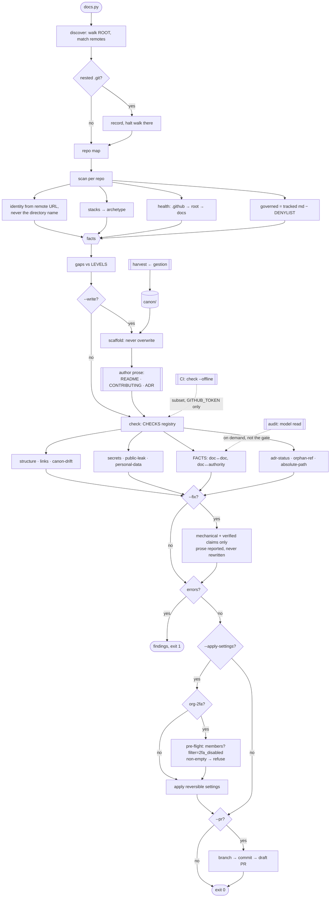

Audit first. Scaffold second. The docs already exist and are already wrong.

## Persistence

Active for the whole documentation task. No drift back to writing prose from memory of a repo.
Default **full**. Switch: `/repo-docs lite|full|ultra`. Off: "stop repo-docs".

## Run it, don't guess

```
python3 ~/.claude/skills/repo-docs/scripts/docs.py <cmd> [args]

discover [--clone]              map every managed clone under ROOT; unmanaged owners refused
scan  <repo>                    inventory as JSON — never writes
check <repo|--all> [--level L] [--offline] [--fix] [--explain] [--save-baseline]
outline <repo>                  the README Section Contract, and which sections are missing
licences <repo>                 what this repo declares, and every third-party licence present
audit <repo>                    emit a prompt for a full model read; not the gate
harvest [exemplar]              refresh canon/ from the profile's exemplar
scaffold <repo> [--level L] [--org] [--write]
settings <repo> [--apply-settings]
pr <repo>
selftest
```

`check` is the gate; exit 1 on any error, warnings never fail. `--fix` rewrites only the
mechanical class. `scaffold` needs `--write`. `pr` opens a draft and refuses if anything
non-documentation is dirty. `--all` prints the baseline diff; `--save-baseline` records it.

Policy lives in `profiles/<owner>.json` over `profiles/_base.json` — never in the engine,
never hardcoded in a doc. `config.json` carries machine-local paths only.

## Rules

Run `discover` then `scan` before writing one word. Never document from memory of the repo.

Craft goes in the engine, decisions go in a profile (ADR 0002). If a rule needs to know what
*this* organisation chose, it reads `P[...]`; it never hardcodes the answer.

Audit before authoring. A wrong doc costs more than a missing one — fix contradictions before
filling gaps.

Org before repo. If every repo wants the file, it belongs in `APS-Conecta/.github`. A repo-local
copy only when it must differ. Repo-local always wins the lookup.

The org `.github` repo is **world-readable** and everything it serves is private. Hardening
checklists, vault names, bind addresses, host paths, contributor names never go there.

Mechanical files come from `canon/`; drift is a bug, `--fix` restores it. `LICENSE` and
`CHANGELOG.md` are seeds — written once when absent, never restored, they accumulate real content.

Prose is authored, never templated. A templated README reads like one.

One fact, one authority. A claim a machine can check must match the machine. Unknown → `$PLACEHOLDER`,
and say so.

One repo, one licence — declared identically in `LICENSE`, `appinfo/info.xml`, `composer.json`
and `package.json`. Those are four declarations of the same fact, read by four different tools.
Third-party licences are inventoried from what is installed, not from memory, and the notices
document must match. Copyleft in a dependency no longer conflicts with our own posture. What would
need a human call is a dependency *incompatible* with AGPL-3.0-or-later — GPL-2.0-only is the case
that bites, having no "or later" to take — and **no rule checks this**: `inventory` resolves licences
to coarse families, and `gpl` alone does not say which. Running alongside software is not the same as
linking it, and that distinction decides whether the question arises at all.

Never document a command that does not exist, and never document one no gate runs. A mention of
something retired must say so within its own paragraph; dated history — ADRs, changelogs, bug
logs — is exempt, its date is the label.

Licence posture is **AGPL-3.0-or-later** org-wide — inherited, not chosen: the apps link
`@nextcloud/vue`. See [ADR 0010](https://github.com/APS-Conecta/gestion/blob/main/docs/adr/0010-agpl-across-the-org.md),
which superseded the proprietary posture of ADR 0007. Never emit MIT, Apache or a proprietary licence
for our own code. Third-party notices are someone else's licence and stay. The brand marks are carved
out under AGPL §7(e) — reserved, not relicensed.

Repo docs in English. `profile/README.md` bilingual ES/EN. Spanish clinical terms keep their name
with a gloss on first use.

`CHANGELOG.md` = Keep a Changelog 1.1.0 + SemVer 2.0.0, `Unreleased` always present.
ADRs = MADR, sequential, `Status:` mandatory, never renumber, superseded link forward.
Diátaxis: one page, one mode — never mix tutorial and reference.

The seven documentation rules are owned by
[`gestion/CONTRIBUTING.md`](https://github.com/APS-Conecta/gestion/blob/main/CONTRIBUTING.md) —
**read them there.** They used to be restated here, directly under the sentence saying "link, don't
restate", and the two copies had already disagreed about which files count as dated history.

What this engine enforces mechanically, so the rules are not only advice: `phantom-command` and
`unverified-command` (rule 4), `fact-contradiction` and `fact-vs-reality` (rule 5), `licence-prose`
and `licence-declaration` (one licence, four declarations), `readme-sections` and
`unfilled-contract` (the Section Contract), `adr-status` (MADR), `github-metadata` (a description is
documentation too), `diataxis-verification` (a typed guide must tell the reader how to check it
worked). Rules 1, 2, 3, 6 and 7 are judgment and are read, never checked.

Dated history is exempt from the retirement rule; `gestion/CONTRIBUTING.md` names which four files
that means, and `is_history()` matches exactly those.

Reference docs for a library or framework come from **Context7 MCP** (`resolve-library-id` then
`query-docs`) — never hardcoded. Context7 absent → `WebFetch` the canonical URL. Never a hard
dependency.

## Intensity

| Level | Emits |
|---|---|
| **lite** | README + LICENSE + one working quickstart. Nothing else |
| **full** | + CHANGELOG, `.github/` CONTRIBUTING · SECURITY · CODEOWNERS · PR + issue forms, pre-commit hook, `docs.yml` gate |
| **ultra** | + ADR set with statuses, archetype reference stubs, `docs/` Diátaxis split |
| `--org` | public `.github` defaults only. No LICENSE — it cannot be defaulted. `profile/README.md` preserved |

`scaffold` writes a **Section Contract** for a README, never a bare placeholder: the sections that
archetype owes, each with what it must contain. The same contract gates the result, so what the
skill asks for and what it accepts cannot drift. An unfilled marker fails the gate — a shipped
outline looks like documentation and is not.

## Auto-Clarity

Write in full, unterse prose for: licence text, security disclosure wording, anything legally
binding, destructive migration steps. Compression there costs more than it saves.

## Amend

The skill is ours and gets tuned constantly. A rule that fires wrong is a defect **in the skill**,
not a doc to hand-patch: fix the `@rule`/`@fact` row or the table it reads, re-run `check --all`,
log one line in `CHANGELOG.md` naming the repo that taught it. Hand-patching the document and
moving on loses the lesson.

A rule that has never fired across the org gets deleted — `DENYLIST` was measured at zero
exclusions and cut. Recurring `audit` findings get promoted to a `@fact` or `@rule`. Extend by
table: policy in `profiles/*.json` (`stack_markers`, `archetypes`, `section_prompts`, `canon`,
`levels`, `claim_boxes`, `internal_patterns`), rules in `CHECKS`, `FACTS`, `SETTINGS`.
If tuning needs a function body edited, the seam is wrong; move it into a table first.

`--explain` prints each firing rule's rationale, so a wrong finding names the line to edit.

`baseline.json` records the last known findings per repo. Every `--all` run diffs against it:
what is new, resolved, still open. A rule that turns up new in *every* repo at once broke — the
documentation did not all rot overnight, and the run says so.

## Boundaries

Writes Markdown into target repos. Draft PRs only on `--pr`. GitHub settings only on
`--apply-settings`, and `org-2fa` only past its pre-flight — enforcing it removes members who lack
2FA, and the org has one member. Never merges, never force-pushes, never touches `main` directly,
never renames a branch, never restructures a working tree, never edits source code to make a doc true.

`references/layout.md` and `references/conventions.md` load on demand. Don't inline them.

## Pipeline



`scan` reads, `scaffold`/`--fix` write, `settings`/`pr` mutate GitHub, `check` owns the exit code.
One responsibility each.
